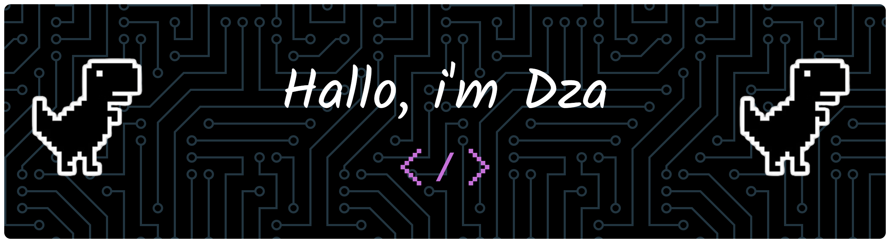

<!-- #### SkillS -->
<h5 align="center">🪄Technologies & Tools 🧩</h5>

<!-- 

 -->

  
  
  
  
  
  
  
  
  
   

<!--  -->

<!-- #### Connect Me  -->
<h5 align="center">Let's Connect!😎</h5>

  

<!-- ##### <h5 align="center"> 📊 GitHub Stats</h5>
 
 
 -->

<h5 align="center">📊 GitHub Stats</h5>

 
 

##### <h5 align="center"> 📊 Quote</h5>

---

